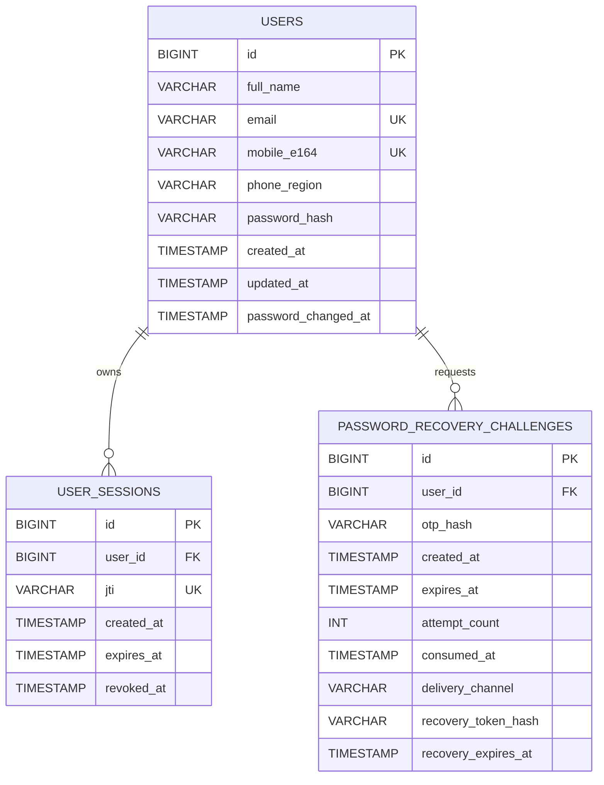

# Authentication ER diagram

```mermaid
erDiagram
    USERS ||--o{ USER_SESSIONS : owns
    USERS ||--o{ PASSWORD_RECOVERY_CHALLENGES : requests
    USERS {
        BIGINT id PK
        VARCHAR full_name
        VARCHAR email UK
        VARCHAR mobile_e164 UK
        VARCHAR phone_region
        VARCHAR password_hash
        TIMESTAMP created_at
        TIMESTAMP updated_at
        TIMESTAMP password_changed_at
    }
    USER_SESSIONS {
        BIGINT id PK
        BIGINT user_id FK
        VARCHAR jti UK
        TIMESTAMP created_at
        TIMESTAMP expires_at
        TIMESTAMP revoked_at
    }
    PASSWORD_RECOVERY_CHALLENGES {
        BIGINT id PK
        BIGINT user_id FK
        VARCHAR otp_hash
        TIMESTAMP created_at
        TIMESTAMP expires_at
        INT attempt_count
        TIMESTAMP consumed_at
        VARCHAR delivery_channel
        VARCHAR recovery_token_hash
        TIMESTAMP recovery_expires_at
    }
```
